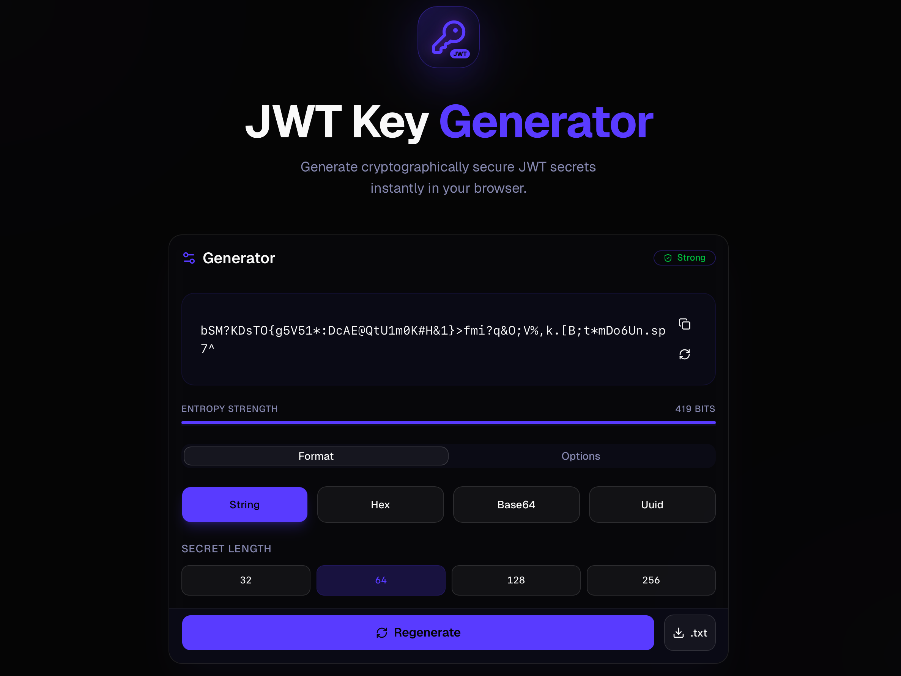

# 🔐 JWT Key Generator

A modern, privacy-first JWT Secret Key Generator built with React, TypeScript, and the Web Crypto API. Generate strong signing keys instantly—right in your browser.


🌐 **Live Demo:** https://jwt-key-generator-sandy.vercel.app

---

## ✨ Features

* 🔒 Generate cryptographically secure JWT secret keys
* ⚡ Instant key generation
* 📋 One-click copy to clipboard
* 🌐 100% Client-side processing
* 🔐 No data is stored or transmitted
* 📱 Fully responsive UI
* 🎨 Clean and modern interface
* 🚀 Lightning-fast performance
* 💻 Works in all modern browsers

---

## 🔑 Supported Output Formats

- Plain Text
- Base64
- Hex
- UUID

---

## 📸 Preview


```text
assets/
├── homepage.png
└── mobile.png
```

Then include:

```md

```

---

# 🚀 Live Website

Visit the application here:

**https://jwt-key-generator-sandy.vercel.app**

---

# 🛠️ Tech Stack

- React 19
- TypeScript
- Vite
- Tailwind CSS
- shadcn/ui
- Motion
- Lucide React
- Sonner
- Web Crypto API
- UUID
- Vercel
  
---

# 🔐 Security

This application prioritizes privacy and security.

* All secret keys are generated locally in your browser.
* No generated keys are sent to any server.
* No tracking of generated secrets.
* Uses the browser's Web Crypto API (`window.crypto.getRandomValues()`), ensuring cryptographically secure random values suitable for generating JWT signing secrets.
  
---

# 📦 Installation

### 1. Clone the repository

```bash
git clone https://github.com/developeR2611/JWT-KEY-generator.git
```

### 2. Navigate to the project directory

```bash
cd JWT-KEY-generator
```

### 3. Install dependencies

```bash
npm install
```

### 4. Start the development server

```bash
npm run dev
```

### 5. Open your browser

Visit the local development server (typically):

```text
http://localhost:5173
```

### 6. Build for production

```bash
npm run build
```

### 7. Preview the production build

```bash
npm run preview
```

---

## 🚀 Usage

1. Open the website.

2. Select your preferred key length.

3. Choose the desired output format.

4. Generate a secure JWT secret.

5. Copy or download it.

---

# 📂 Project Structure

```text
JWT-KEY-generator/
│
├── src/
│   ├── App.tsx            # Main application (almost all business logic)
│   ├── main.tsx           # React entry point
│   └── index.css          # Global styles
│
├── components/
│   └── ui/                # Reusable Shadcn UI components
│       ├── button.tsx
│       ├── input.tsx
│       ├── card.tsx
│       ├── tabs.tsx
│       ├── switch.tsx
│       ├── slider.tsx
│       ├── badge.tsx
│       ├── dialog.tsx
│       ├── progress.tsx
│       ├── tooltip.tsx
│       ├── label.tsx
│       └── sonner.tsx
│
├── lib/
│   └── utils.ts           # Utility helpers (cn function)
│
├── package.json
├── vite.config.ts
├── tsconfig.json
├── metadata.json
├── README.md
└── .env.example
```


---

# 💡 Why Use This Tool?

Generating weak JWT secrets can expose applications to security vulnerabilities.

This generator helps developers create:

* Strong JWT secrets
* Random authentication keys
* Secure API signing keys
* Development and production-ready secrets

---

# 🔥 Use Cases

* JWT Authentication
* Express.js APIs
* Node.js Applications
* Next.js Projects
* React Applications
* NestJS
* Fastify
* Backend Services
* Authentication Systems

---

# 🤝 Contributing

Contributions are always welcome!

1. Fork the repository
2. Create your feature branch

```bash
git checkout -b feature/AmazingFeature
```

3. Commit your changes

```bash
git commit -m "Add AmazingFeature"
```

4. Push to the branch

```bash
git push origin feature/AmazingFeature
```

5. Open a Pull Request

---

# 🐛 Found a Bug?

If you discover a bug or have a feature request, please open an Issue.

---

# ⭐ Support

If you found this project useful, consider giving it a ⭐ on GitHub.

It helps others discover the project and motivates future development.

---

# 📄 License

This project is licensed under the **MIT License**.

Feel free to use, modify, and distribute it.

---

# 👨‍💻 Author

**Ravi Gupta**

GitHub: **@developeR2611**

---

## 🔒 Disclaimer

This tool is intended for generating secure JWT secret keys.

Always follow security best practices when storing secrets:

* Never hardcode secrets in source code.
* Store secrets in environment variables.
* Rotate secrets periodically.
* Never expose production secrets publicly.

---

## 🌟 Show Your Support

If this project helped you, don't forget to:

⭐ Star the repository

🍴 Fork it

📢 Share it with fellow developers

Happy Coding! 🚀
